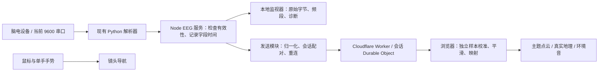

# 在野 · Go Wild 脑电接入计划

日期：2026-10-10。状态：已按本方案实施 EEG v2；验证与发布记录见 HANDOFF.md。以下保留设计目标与验收要求，实际通过项及未完成真人动作验收须以交接记录为准。

## 目标与第一版范围

使用当前 ThinkGear 兼容设备已经输出的 attention、meditation 和 poorSignal，实现真实脑电驱动的点云、光影和环境音反馈。保留鼠标和单手手势控制镜头。支持本地页面及 Cloudflare 线上页面，支持 10 个主题点云和富士山、大峡谷两种真实地理场景。

第一版不等待 RAW、不切换串口波特率、不增加硬件，不用大模型计算实时反馈。8 个频段及原始字节继续留在本地监视器，不默认上传；心率作为可选能力，不伪造数值。

设备当前约 1.05–1.07 秒更新一次指标。attention / meditation 的 0 表示不能可靠计算；poorSignal 的 0 表示没有报告信号污染，两者必须分别解释。它们是相对指标，界面不显示成生理状态的百分比。[官方协议](https://developer.neurosky.com/docs/doku.php?id=thinkgear_communications_protocol)、[eSense 定义](https://developer.neurosky.com/docs/doku.php?id=esenses_tm)。

## 1. 数据链路与职责



- Python 继续作为唯一串口读取者，保留现有包校验与解析。新增发送模块订阅已经解析的数据，不再次打开串口。
- Node EEG 服务统一处理字段更新时间、有效性及标准化；原始观测值保留在本地。
- Node 主动连接云端。线上 HTTPS 页面通过现有同源会话接收，不依赖它直接访问 localhost。
- Cloudflare 验证、隔离、去重、转发，不计算个体基线或存储脑电历史。
- 浏览器处理个人校准、控制信号平滑与视觉映射。绘制频率与约 1 Hz 采集频率独立。
- 本地开发走同样的标准化协议，将发送目标设为本机在野服务。
- AI Gateway 仍只用于用户主动提交的目的地推荐，不接收这条实时脑电数据流。

## 2. 统一协议

按用户要求直接替换现有设备协议，统一使用 mindscape.eeg.v2，不保留 mindscape.v1 的解析器、兼容分支或降级路径。新协议允许 HR 缺失，并携带来源与字段时效；采集桥接、本地服务、Worker、前端及相关测试同步迁移。模拟器作为体验功能保留，输出统一的内部信号结构，不依赖旧网络协议。

以下是有效读数的示意包，时间为示意值，实际使用本地主机接收时间：

```json
{
  "type": "sensor",
  "protocol": "mindscape.eeg.v2",
  "streamId": "一次串口采集生命周期的 UUID",
  "seq": 123,
  "capturedAt": 1791638488926,
  "source": "thinkgear",
  "frame": {
    "attention": 0.70,
    "relaxation": 0.23,
    "HR": null,
    "poorSignal": 0,
    "signalQuality": 1,
    "valid": {"attention": true, "relaxation": true, "HR": false},
    "ageMs": {"attention": 0, "relaxation": 0, "poorSignal": 0},
    "sampleIds": {"attention": 120, "relaxation": 119, "poorSignal": 121}
  },
  "capabilities": {"heartRate": false, "raw": false}
}
```

协议规则：

- attention / relaxation 为原设备 1–100 有效值除以 100，不在桥接端做个人基线调整。原值 0、越界或缺失时对应 value 为 null、valid 为 false。
- HR 为有限有效值或 null。所有校验、渲染、音频、趋势、推荐请求和 UI 均须处理缺失，禁止默认 72 作为设备测量值。
- poorSignal 保留设备原值。第一版 signalQuality 仅表示应用是否接受该信号，不把 0–255 简单线性映射为“准确率”。有效性由 poorSignal、字段时效和指标合法性共同推导，云端不能仅信任发送者的 valid 标记。
- seq 只在收到新的相关设备观测时递增。心跳和网页绘制不能制造新脑电样本。每个指标有独立 sampleId 及更新时间；只有专注度更新时不能重计旧冥想值。相同数值的新设备读数仍是新样本，不能按数值是否改变去重。
- streamId 在串口重开、重启采集或切换设备后更换；网络重连仍使用原 streamId。只有当前有效发送连接可更新会话，旧连接的迟到包不能覆盖新连接。
- capturedAt 是主机接收时间，不是硬件采样时钟；本地字段年龄使用单调时钟计算。Worker 额外标注接收时间，浏览器记录本地到达时间。
- 新鲜度同时考虑字段年龄、连续到达情况和链路延迟；不直接假定 Mac 与云端时钟一致。链路延迟无法满足时效要求时暂停联动。具体延迟估算在传输测试中验证。
- 心跳、连接状态和指标数据分开。旧包、重复包、过期缓存不能刷新指标有效期，也不能增加校准样本数。
- 断网仅保留最新候选数据，不建立历史重放队列；重连后仅发送仍然新鲜的读数。
- HTTP 与 WebSocket 统一校验 mindscape.eeg.v2；广播统一使用 `eeg-frame`，前端只解析这一种设备数据消息。删除旧 `frame` 接收分支及旧四字段请求格式。缺少协议标识、旧版本或未知版本均明确拒绝，不自动猜测或转换；客户端提示更新到匹配版本。

## 3. 配对与发送

用户流程：

1. 打开线上在野，选择设备模式，复制当前会话的接入配置。
2. 打开本地脑电监视器的“连接在野”，粘贴配置。
3. 点击“开始联动”。本地服务校验目标，使用 Authorization 请求头建立 WSS 连接。
4. 两边分别显示串口状态、设备信号、云端发送状态与最近有效读数时间。
5. 点击“停止联动”只停止发送，监视器仍可继续读取。释放串口是独立操作。

第一版沿用现有 24 小时会话配置。凭据仅保存在当前本地服务内存，不进入 URL、日志、导出或 Git；过期后停止重试并提示重新配对，不自行创建另一个用户看不到的会话。

默认仅接受本项目线上 HTTPS/WSS 域名及明确的回环开发地址，避免把粘贴配置作为任意服务器访问入口。本地配置接口继续执行 Host / Origin 检查。

WSS 为主传输，HTTP POST 为开发和排错路径。断线按约 1、2、4、8、15 秒上限加抖动重连；401、会话过期和明确配置错误转为需要重新配对。发送端用最新值覆盖待发值，防止堵塞导致延迟累积。约 1 Hz 指标按实际更新发送，不补成 25 Hz。连接心跳不刷新脑电时效。

## 4. 状态与异常处理

传输状态与信号状态分离，不能把 WebSocket 已连接显示成脑电已有效。

| 状态 | 进入条件 | 场景与 UI |
| --- | --- | --- |
| 等待设备 | 没有有效设备读数 | 显示等待，不用模拟器默认值冒充实测 |
| 等待稳定 | 刚连接或刚恢复 | 连续 3 个有效新读数后进入可用状态 |
| 可用、未校准 | 信号有效 | 使用温和默认映射，允许体验并提示校准 |
| 校准中 | 用户主动开始 | 收集有效独立样本，显示时间和样本进度 |
| 脑电联动 | 信号有效且开启联动 | 平滑更新视觉控制量 |
| 接触异常 | 新 poorSignal 非零，或指标无效 | 立即阻止受影响指标更新，保持最后有效效果 |
| 数据过期 | 某必需字段约 2.5 秒无有效更新 | 标记过期，冻结受影响控制量 |
| 断连 | 设备关闭或连接中断 | 显示恢复指引，镜头仍可操作 |
| 用户暂停 | 用户暂停反馈 | 继续监视，冻结脑电视觉输出与校准计时 |

恢复后从当前视觉状态平滑过渡，不跳到新值；数据缺失不能触发“紧张”“漂散”等状态文案。无有效初始读数时使用明确的默认环境氛围，指标显示空值。只有某一指标无效时冻结该指标，不能用另一指标更新来延长它的时效。

连续离线超过约 10 秒时将联动标记为暂停，保留当前画面与导航；仍在播放的环境音不称为实时脑电响应。重新开始串口采集后使旧校准失效；网络短暂重连可保留同一采集流的基线。

## 5. 校准与控制信号

所有数值为工程初值，须经真实设备测试调整，不是测量精度或医学阈值。

**校准：**与实际体验相同的睁眼、坐姿条件下，至少持续 30 秒，并为每个参与联动的指标收集至少 25 个有效独立读数；最多等待 60 秒。无效数据不计数；暂停及隐藏页面不累积校准时长。超时不足则明确失败，不生成基线。

以有效读数的中位数作为个人基线，MAD 作为波动参考；尺度设置下限，避免把几分抖动放大到整个控制区间。不要用当前观测的 min / max 强行拉满 0–1。基线在本次采集过程中固定，用户可主动重校准。

保留三层独立数据：

1. 原始设备读数：如专注度 70、冥想指标 23。
2. 已校准的交互控制量：0–1，仅供控制效果，不伪装成设备分数。
3. 实际视觉参数：经平滑、限幅与手动设置组合后的参数。

推荐起始算法：3 个独立读数的短中值去尖峰 → 基于个人基线的有界映射 → 约 3 秒时间常数的指数平滑 → 每秒最大变化 0.10。可配置约 3 分的小变化死区；所有平滑依据实际经过时间，不依据包数或画面帧数。

未校准时使用有幅度限制的绝对分数映射；校准后中位水平对应中等氛围强度，并保留低/高状态变化空间。避免 eSense 本身已经自适应、应用又持续自动追踪基线而使反馈被抵消。

验收期望是持续变化在数秒内可感知、短促异常不造成画面突跳；不要求用户一定能在规定时间“提高分数”。

## 6. 视觉与声音映射

新增统一控制对象，例如 `relaxationControl`、`attentionControl`、`feedbackEnabled`、`validity`，由同一个映射模块输出给两类渲染器和音频引擎。不要把视觉聚合程度称为脑电相干性；现有 coherence 仅是内部视觉变量。

| 输入 | 10 个主题点云 | 富士山 / 大峡谷 | 声音 |
| --- | --- | --- | --- |
| 冥想控制量 | 聚散范围、流动速度、辅助粒子强度 | 辅助粒子、温和光晕与氛围流动；默认不改地形坐标 | 噪声与和声混合、滤波器柔和变化 |
| 专注控制量 | 限幅的亮度与光点突出程度 | 限幅的亮度、细节强调 | 第一版不增加额外独立映射 |
| 接触质量 / 时效 | 决定是否继续采用数据 | 同左 | 同左 |
| 心率 | 缺失时停止心率联动 | 缺失时停止心率联动 | 不根据 EEG 编造心率节奏 |

镜头位置、方向和视距由鼠标、键盘和单手手势控制；脑电不抢占导航，也不自动切换目的地。点数量、LOD 与渲染分辨率仍由画质与性能策略控制，不随脑电分数变化。

保留“原始展示”作为中性对照：不叠加脑电视觉调制。新增“脑电氛围”明确入口，不能暗中把原始点云模式切换为变形模式。主题点云可以采用克制的聚散；真实地理场景以独立辅助层表现，不让山体和测量坐标漂移。

手动视觉预设作为基础设置，脑电只提供有上下限的偏移；关闭脑电后平滑回到用户设定，不重置手动参数。暂停、世界切换、原始模式和降低动态效果偏好都有明确优先级。音量由用户控制，声音须经用户手势启用；低分不放大噪声到令人不适的水平。

## 7. 界面调整

- 设备接入面板分别显示“本机采集”“云端桥接”“指标有效”“个人基线”状态。
- 提供开始/停止联动、复制配对配置、校准/重新校准和原始展示对照。
- 专注与冥想显示 0–100 相对分，不显示百分号；无心率显示“未接入”。保留设备读数与视觉响应量的区别。
- 趋势只添加独立指标样本，并保留时间戳；无效或离线时显示断点/历史标记，不延伸成新的水平实测曲线。
- 校准显示有效样本数及时间；校准过程中断不会虚报成功。
- 设备状态文案使用“信号稳定”“接触待调整”等；视觉效果文案与用户心理状态判断分离。
- 手动模拟器仍可用，但切换须明确，由设备模式进入模拟器时清除设备专属校准和旧读数，反向切换先等待新数据。
- 60 秒呼吸引导仍为引导节奏，不宣称测得呼吸；在设备模式下可引导呼吸，但不能悄悄用 demoFrame 替换真实数据。
- 更新帮助文档中“必须发送 HR”“建议补到 25 Hz”“10 秒校准”等旧说明。

## 8. 文件与工作分解

下列新增文件名为建议，实施时保持职责边界。

| 阶段 | 涉及文件 | 交付物 / 通过条件 |
| --- | --- | --- |
| A：协议与有效性 | 新增 `src/core/eeg-protocol.mjs`；调整 `src/core/state.mjs` | 单一协议校验、HR 可选、逐字段有效性；移除旧校验与兼容测试，新增旧格式拒绝测试 |
| B：本地桥接 | `server/eeg.mjs`；新增 `server/eeg-forwarder.mjs`；`src/eeg/` | 复用现有串口数据，配对、WSS、停止、重连与最新值发送；不影响监视器 |
| C：云端会话 | `worker/index.mjs`、`server/index.mjs` | HTTP/WS 统一新协议、会话隔离、序号去重、连接所有权与新鲜度；旧格式明确拒绝 |
| D：信号处理 | 新增 `src/core/eeg-feedback.mjs`；`src/main.jsx` | 独立读数校准、状态机、平滑限幅、暂停/恢复、缺失值显示 |
| E：场景与 UI | `src/renderer.js`、`src/geo-renderer.js`、`src/VisualControls.jsx`、`src/audio.js`、设备面板 | 两类渲染器共用反馈；手势可同时使用；地理主体不变形 |
| F：验证与发布 | `tests/`、`EEG-MONITOR.md`、`CLOUDFLARE.md`、`README.md` | 自动与真实设备验收记录、构建、整套切换与回滚步骤；删除旧协议文档及示例 |

依赖顺序 A → B/C → D → E → F。已有地理场景代码与独立脑电监视器有并行工作，实施前检查工作区，使用有范围的差异，避免覆盖已有改动。

## 9. 验收矩阵

| 测试 | 必须达到的结果 |
| --- | --- |
| 旧协议、无协议标识、未知版本 | 明确拒绝，不触发自动转换或降级；正确提示更新客户端 |
| 有效数据 / eSense=0 / poorSignal 非零 / 缺字段 / NaN | 正确区分可用、无效和未知，数值不进入非法 shader 状态 |
| HR 缺失 | 允许 EEG 正常联动；UI 无假心率；无 NaN 或虚构脉动 |
| 序号重复、乱序、部分字段更新、心跳 | 不重复计校准，不让旧字段变新鲜 |
| 只有 1 个脑电样本，渲染 600 帧 | 校准仍只记 1 个样本 |
| 约 1 Hz 输入、不同渲染帧率 | 控制曲线按时间保持一致 |
| 偶发坏包、2.5 秒过期、设备断开 | 保持最后有效效果，正确显示状态，不突变为“紧张” |
| 重连、旧连接迟到包、换设备 | 不回放旧值，不被旧连接覆盖；换采集流重置基线 |
| 会话隔离、配对错误、过期、重连等待 | A 会话不能影响 B；不绕过过期；凭据不出现在日志 |
| 校准成功 / 不足 / 暂停 / 隐藏标签页 | 只统计有效独立样本，时长与进度准确 |
| 原始模式 / 脑电氛围 / 手动预设 / 60 秒引导 | 状态来源明确，设置不互相覆盖，不切换到假数据 |
| 单手平移、捏合连续缩放同时进行 | 镜头无脑电引起的跳动，接触异常时氛围保持 |
| 富士山 / 大峡谷 | 氛围可变化，真实地形坐标与地图导航保持一致 |
| 真实设备持续运行 10 分钟 | 无重连循环、队列累积或持续内存增长；记录有效比例和延迟 |
| 性能对照 | 同设备、同视角下记录联动开/关；目标帧率下降不超过约 5%，以实测结果决定是否降低辅助层复杂度 |

真实设备测试依次观察自然静坐、正常探索、手势操作、短暂接触丢失和恢复。需要用户主动动作的部分在联调时给出简短引导。测试评价数据与交互可靠性，不以“指定动作一定使某个分数升高”作为通过标准。

诊断默认只记录本地汇总（独立样本数、有效比例、字段年龄、重连次数、处理耗时）；详细脑电录制沿用监视器显式导出，不增加隐式云端历史保存。

## 10. 发布、回滚与完成定义

1. 先完成本地回放/真实数据链路和协议测试。
2. 停止设备发送，将新 Worker 与静态前端作为同一发布版本部署，同时更新本地桥接。刷新页面，关闭或断开旧连接；完成新协议握手并确认版本一致后，重新配对和开启发送。发布窗口内允许短暂中断，不维持旧协议兼容。
3. 使用当前用户的配对会话验证线上完整链路，测试另一个会话不受影响。
4. 验证主题点云与两个地理场景，保存不含凭据的验收记录。
5. 回滚时先停止发送与关闭脑电联动，再整体恢复已验证、相互匹配的 Worker、前端和本地桥接版本。此次切换前的版本没有完整脑电接入，若回到它就保持脑电联动关闭，仅保留监视器和原场景体验；不为回滚在新版本中保留旧协议代码，不改设备硬件设置。

完成定义：用户启动现有采集服务，粘贴线上配对配置，能看到真实指标；校准按独立样本完成；开启脑电氛围后两类场景和声音产生平滑、可感知的变化；手势导航仍独立有效；失联、无心率、暂停和重连均有确定行为；线上与本地验证通过。

后续可选：8 频段的相对变化与伪迹分析、RAW 输出配置和独立算法、真实心率设备、长期个体基线。均不阻塞本版交付。
